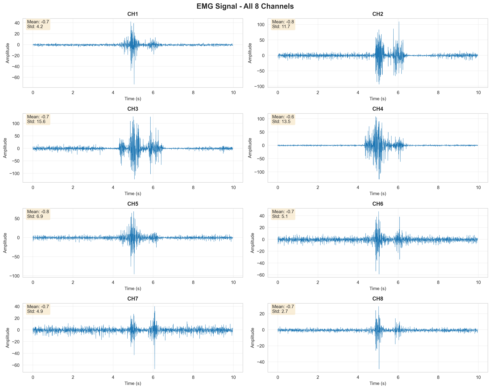
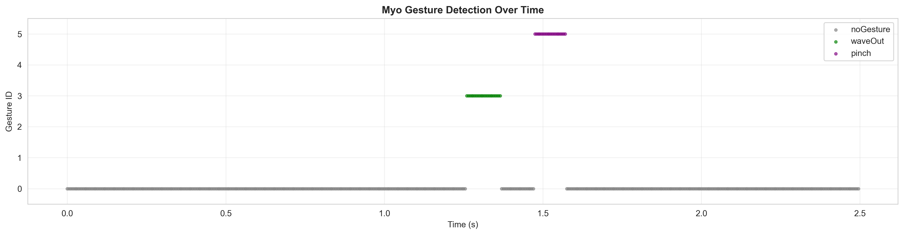
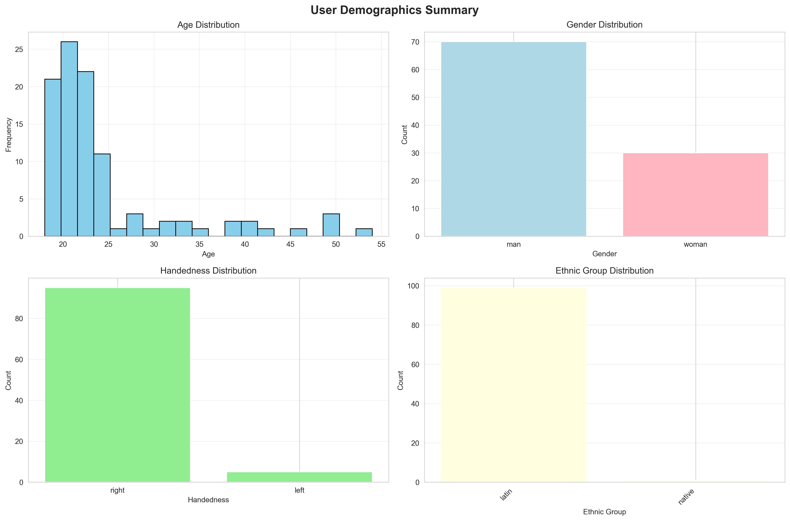
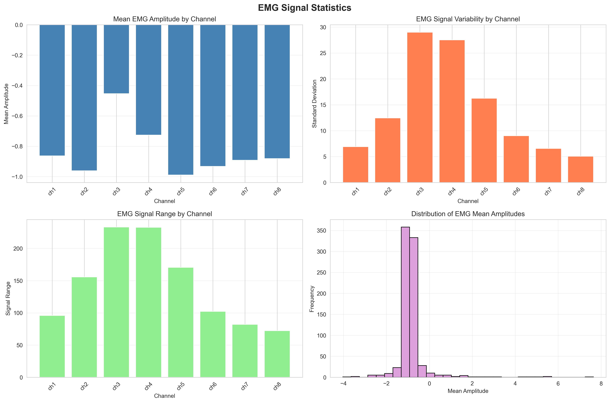
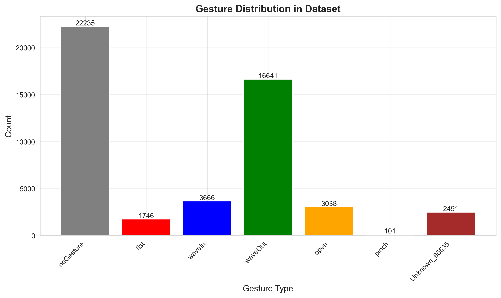

# EMG-EPN612 データセット分析とモデル構築

EMG-EPN612データセットの探索的データ分析（EDA）とジェスチャー認識モデルの実装を提供するリポジトリです。

## 🌿 ブランチ構成

- **main/master**: EDA（探索的データ分析）
- **baseline**: 機械学習モデル実装（ベースラインモデル）

## 📊 概要

EMG-EPN612データセットは、Myo Armbandを使用して記録された筋電図（EMG）信号を含むジェスチャー認識用データセットです。本リポジトリでは、包括的なデータ分析スクリプトと詳細な分析結果を提供しています。

### データセット仕様
- **総ユーザー数**: 612名（トレーニング306名、テスト306名）
- **デバイス**: Myo Armband
- **サンプリング周波数**: 200 Hz
- **記録時間**: 1ジェスチャーあたり5秒
- **EMGチャンネル数**: 8チャンネル
- **ジェスチャークラス**: 6種類（fist, waveIn, waveOut, open, pinch, noGesture）

---

## 📁 リポジトリ構成

```
.
├── emg_eda.py                      # EDA分析スクリプト
├── eda_results/                    # 分析結果ディレクトリ
│   ├── EDA_REPORT.md              # 包括的な分析レポート（英語）
│   ├── emg_signals_8channels.png  # 8チャンネルEMG信号の可視化
│   ├── gesture_detection_timeline.png  # ジェスチャー検出タイムライン
│   ├── demographics_summary.png   # ユーザー属性の可視化
│   ├── emg_statistics_summary.png # EMG統計の可視化
│   ├── gesture_distribution.png   # ジェスチャー頻度分布
│   ├── demographics_stats.csv     # 詳細な属性統計
│   └── emg_stats.csv             # 詳細なEMG統計
├── .gitignore                     # Git無視ファイル（データセットを除外）
└── README.md                      # このファイル
```

---

## 💾 データセットのダウンロード

実際のデータセットファイル（`trainingJSON/`と`testingJSON/`）は、サイズの都合上このリポジトリには含まれていません。

データセットのダウンロード方法：
1. EMG-EPN612データセットを元のソースからダウンロード
2. ダウンロードした`trainingJSON/`と`testingJSON/`フォルダをルートディレクトリに配置

---

## 🔧 必要なライブラリ

```bash
pip install numpy pandas matplotlib seaborn
```

Python 3.7以上が必要です。

---

## 🚀 使用方法

1. データセットをルートディレクトリに配置
2. EDAスクリプトを実行：

```bash
python emg_eda.py
```

スクリプトの実行内容：
- データセット構造と属性の分析
- EMG信号統計の計算
- 可視化の生成
- 包括的なレポートの作成

すべての結果は`eda_results/`ディレクトリに保存されます。

---

## 📈 分析結果

### 1. EMG信号の可視化

#### 8チャンネルEMG信号


8つのEMGチャンネルの時系列信号を表示。各チャンネルの平均値と標準偏差も表示されています。

#### ジェスチャー検出タイムライン


時間経過に伴うジェスチャー検出の推移を可視化。各ジェスチャーが異なる色で表現されています。

---

### 2. ユーザー属性分析



#### 主な発見
- **年齢**: 平均24.3歳（範囲：18-54歳）
- **性別**: 男性70%、女性30%
- **利き手**: 右手95%、左手5%
- **民族**: 複数の民族グループが含まれる

⚠️ **注意**: データセットには若年成人への偏りがあり、性別にも不均衡が見られます。

---

### 3. EMG信号統計



#### 全体統計
- **平均振幅**: -0.84 ± 0.76
- **標準偏差**: 14.10 ± 12.57
- **信号範囲**: 143.10 ± 79.80

#### チャンネル別の特徴

| チャンネル | 平均振幅 | 標準偏差 | 信号範囲 |
|-----------|---------|---------|---------|
| CH1 | -0.86 ± 0.15 | 6.92 ± 3.65 | 95.90 ± 47.78 |
| CH2 | -0.96 ± 0.22 | 12.46 ± 5.71 | 155.62 ± 60.44 |
| CH3 | -0.45 ± 1.29 | 28.99 ± 12.80 | 233.15 ± 52.58 |
| CH4 | -0.73 ± 1.60 | 27.53 ± 13.09 | 232.77 ± 38.98 |
| CH5 | -0.99 ± 0.18 | 16.25 ± 10.70 | 170.60 ± 58.48 |
| CH6 | -0.93 ± 0.20 | 9.01 ± 10.25 | 102.27 ± 58.88 |
| CH7 | -0.89 ± 0.16 | 6.58 ± 6.15 | 82.14 ± 56.64 |
| CH8 | -0.88 ± 0.15 | 5.06 ± 2.31 | 72.32 ± 33.12 |

**重要な発見**:
- **Channel 3と4**が最も高い変動性を示す（標準偏差 ~28-29）
- より動的な筋肉活動を捉えている可能性が高い
- **Channel 1, 7, 8**は比較的安定した信号

---

### 4. ジェスチャー分布



| ジェスチャー | サンプル数 | 割合 |
|-------------|-----------|------|
| No Gesture | 22,235 | 44.5% |
| Wave Out | 16,641 | 33.3% |
| Wave In | 3,666 | 7.3% |
| Open | 3,038 | 6.1% |
| Fist | 1,746 | 3.5% |
| Pinch | 101 | 0.2% |

⚠️ **クラス不均衡の問題**:
- "No Gesture"が44.5%で最多
- "Pinch"がわずか0.2%で極端に少ない
- 機械学習モデル訓練時には**クラス重み付け**や**データ拡張**が必要

---

## 🔍 EDAスクリプトの機能

1. **データセット概要**
   - ユーザー数と分布
   - 記録仕様

2. **属性分析**
   - 年齢、性別、利き手の分布
   - 民族的多様性

3. **EMG信号分析**
   - チャンネル別統計
   - 信号振幅と変動性
   - ジェスチャー頻度分布

4. **可視化**
   - 8チャンネルEMG時系列プロット
   - ジェスチャー検出タイムライン
   - 統計サマリープロット
   - 属性分布チャート

5. **統計レポート**
   - 詳細統計のCSVファイル
   - 包括的なMarkdownレポート

---

## 🤖 機械学習開発の推奨事項

### 1. 前処理
```python
# 推奨される前処理パイプライン
- バンドパスフィルタ（20-450 Hz）
- ノッチフィルタ（50/60 Hz電源ノイズ除去）
- 正規化/標準化
```

### 2. 特徴量エンジニアリング

**時間領域特徴量**:
- RMS（二乗平均平方根）
- MAV（平均絶対値）
- ZC（ゼロクロッシング）
- SSC（傾き符号変化）
- WL（波形長）

**周波数領域特徴量**:
- MNF（平均周波数）
- MDF（中央周波数）
- パワースペクトル密度

**時間-周波数特徴量**:
- ウェーブレット係数
- 短時間フーリエ変換（STFT）

### 3. モデル訓練

**推奨アルゴリズム**:
- **古典的機械学習**: SVM、Random Forest、k-NN
- **深層学習**: CNN、LSTM、CNN-LSTMハイブリッド
- **転移学習**: 事前学習モデルのEMGへの適用

**クラス不均衡への対処**:
```python
# クラス重み付け
from sklearn.utils.class_weight import compute_class_weight

# オーバーサンプリング（SMOTE等）
from imblearn.over_sampling import SMOTE

# データ拡張
- 時間シフト
- ノイズ注入
- スケーリング
```

### 4. 評価戦略

```python
# 推奨される評価指標
- 正解率（Accuracy）だけでなく
- 適合率（Precision）
- 再現率（Recall）
- F1スコア ← クラス不均衡に対して重要
- 混同行列（Confusion Matrix）
- クラス別性能評価
```

**クロスバリデーション**:
- 層化k分割交差検証（Stratified k-fold）を使用
- ユーザー独立評価 vs ユーザー依存評価

---

## 📊 データ品質評価

### ✅ 強み
- 大規模なサンプルサイズ（612ユーザー）
- 高品質な8チャンネルEMGデータ
- 標準化された記録プロトコル（200 Hz、5秒）
- 多様な人口統計学的表現
- 構造化されたJSON形式

### ⚠️ 制限事項
- 顕著なクラス不均衡（特にPinchジェスチャー: 0.2%）
- 性別の不均衡（男性70%、女性30%）
- 利き手の偏り（右手95%）
- 若年成人への年齢の偏り（平均24.3歳）
- 不明なジェスチャー状態の存在（5.0%）

### 💡 推奨対策
1. マイノリティクラスへのデータ拡張適用
2. 訓練/検証分割に層化サンプリングを使用
3. 過小表現ジェスチャーの追加データ収集を検討
4. 適切な評価指標の使用（F1スコア、バランス正解率）

---

## 🎯 潜在的な応用

このデータセットは以下の用途に適しています：

1. **ジェスチャー認識**: リアルタイム手ジェスチャー分類のための機械学習モデル訓練
2. **ヒューマンコンピュータインタラクション**: EMGベースの制御インターフェース開発
3. **義肢制御**: 筋電義肢の筋電制御に関する研究
4. **ユーザー認証**: 生体認証としてのEMG信号の探索
5. **信号処理研究**: EMG信号特性と前処理技術の研究

---

## 📝 ライセンス

元のEMG-EPN612データセットのライセンス条項を参照してください。

---

## 🤝 コントリビューション

コントリビューションを歓迎します！IssueやPull Requestをお気軽に提出してください。

---

## 📧 お問い合わせ

質問や問題がある場合は、GitHubでIssueを開いてください。

---

## 🤖 機械学習モデル（baselineブランチ）

`baseline`ブランチには、ジェスチャー認識のための機械学習モデルが実装されています。

### モデル構築の使用方法

```bash
# baselineブランチに切り替え
git checkout baseline

# 依存ライブラリをインストール
pip install -r requirements_ml.txt

# ベースラインモデルを訓練
python train_baseline.py --data_path . --max_users 20 --model_type random_forest
```

### 実装されているモデル

- **Random Forest**: アンサンブル学習ベースの分類器
- **SVM (Support Vector Machine)**: サポートベクターマシン
- **k-NN (k-Nearest Neighbors)**: 最近傍法

### 主な機能

1. **データローダー** (`src/data/data_loader.py`)
   - EMG-EPN612データセットの読み込み
   - ウィンドウベースのセグメンテーション
   - 層化サンプリング

2. **特徴量抽出** (`src/features/feature_extractor.py`)
   - 時間領域特徴量（MAV, RMS, ZC, SSC, WL等）
   - 周波数領域特徴量（MNF, MDF, パワースペクトル等）
   - バンドパス・ノッチフィルタ
   - 信号正規化

3. **ベースラインモデル** (`src/models/baseline_models.py`)
   - クラス不均衡への対処
   - モデル訓練と評価
   - 混同行列と性能比較の可視化

4. **訓練パイプライン** (`train_baseline.py`)
   - エンドツーエンドの訓練パイプライン
   - コマンドライン引数でのカスタマイズ
   - 結果の自動保存

---

## 🧠 深層学習モデル（CNN-LSTM）

### モデルアーキテクチャ

**CNN-LSTMハイブリッドモデル**を実装し、全データセット（306ユーザー、7,836訓練サンプル）でGPU訓練を実施しました。

#### 構成:
- **入力**: 8チャンネル × 200時間ステップ
- **CNNブロック**: 3層（32→64→128フィルタ）
  - 各層: Conv1D → BatchNorm → ReLU → MaxPool → Dropout
- **LSTM**: 双方向2層（隠れ層サイズ128）
- **全結合層**: 256 → 128 → 6クラス
- **パラメータ数**: 791,078個
- **デバイス**: NVIDIA GeForce RTX 5090 (CUDA 12.8)

### 訓練設定

```bash
python train_deep_learning.py --model_type cnn_lstm --epochs 50 --batch_size 64 --lr 0.001
```

- **エポック数**: 50
- **バッチサイズ**: 64
- **最適化手法**: Adam (lr=0.001, weight_decay=1e-4)
- **損失関数**: CrossEntropyLoss（クラスウェイト付き）
- **学習率スケジューラ**: ReduceLROnPlateau
- **データ分割**:
  - 訓練: 6,268サンプル
  - 検証: 1,568サンプル
  - テスト: 7,773サンプル

### 訓練結果

#### 最終精度
- **検証精度**: 70.15% (Epoch 2で達成)
- **テスト精度**: 72.08%

#### 訓練曲線


**観察された現象**:
- Epoch 1-2: 検証精度が70%に急上昇
- Epoch 3以降: 検証精度が3-5%に急落し、その後も低迷
- 訓練精度は47.88%まで緩やかに上昇
- 明らかな**過学習**の兆候

---

### ⚠️ **重大な問題: モデルは実質的にジェスチャーを認識していない**

#### テストセット分類レポート

```
Classification Report (Test Set):
              precision    recall  f1-score   support

  No Gesture       0.72      1.00      0.84      5603
        Fist       0.00      0.00      0.00       258
     Wave In       0.00      0.00      0.00       149
    Wave Out       0.00      0.00      0.00      1493
        Open       0.00      0.00      0.00       270

    accuracy                           0.72      7773
   macro avg       0.14      0.20      0.17      7773
weighted avg       0.52      0.72      0.60      7773
```

#### 検証セット分類レポート

```
Classification Report (Validation Set):
              precision    recall  f1-score   support

  No Gesture       0.70      1.00      0.82      1100
        Fist       0.00      0.00      0.00        42
     Wave In       0.00      0.00      0.00        61
    Wave Out       0.00      0.00      0.00       298
        Open       0.00      0.00      0.00        67

    accuracy                           0.70      1568
   macro avg       0.14      0.20      0.16      1568
weighted avg       0.49      0.70      0.58      1568
```

#### 混同行列


---

### 📊 問題分析

#### 1. **多数派クラス予測（Majority Class Prediction）**

モデルは**すべてのサンプルを「No Gesture」クラスに分類**しています：

- **No Gesture**: Recall = 1.00（すべてのサンプルをNo Gestureと予測）
- **その他のジェスチャー**: Recall = 0.00（全く認識できていない）

#### 2. **見かけ上の高精度の落とし穴**

72.08%という精度は一見良好に見えますが、これは：
- テストセットの72.1%がNo Gestureであるため
- 単純に「すべてNo Gesture」と予測しているだけ
- **実用的なジェスチャー認識モデルとしては完全に機能していない**

#### 3. **根本原因**

##### a) **極端なクラス不均衡**
```
訓練セット:
  No Gesture: 70.4% (5,514サンプル)
  Fist:        2.8% (221サンプル)
  Wave In:     3.1% (240サンプル)
  Wave Out:   19.4% (1,524サンプル)
  Open:        4.3% (336サンプル)
  Pinch:       0.0% (1サンプル)  ← 極端に少ない
```

##### b) **クラスウェイトの限界**
- CrossEntropyLossにクラスウェイトを適用したが不十分
- 重み付けだけでは70:30や80:20のような極端な不均衡には対処しきれない

##### c) **過学習の進行**
- Epoch 2以降、検証精度が急落
- モデルは訓練データの多数派クラスに特化してしまった

---

### 🔧 改善策

#### 1. **データレベルの対策**

##### a) リサンプリング
```python
# アンダーサンプリング: No Gestureクラスを削減
# オーバーサンプリング: マイノリティクラスを増加

from imblearn.over_sampling import SMOTE
from imblearn.under_sampling import RandomUnderSampler
from imblearn.combine import SMOTETomek

# 組み合わせ戦略
smote_tomek = SMOTETomek(random_state=42)
X_resampled, y_resampled = smote_tomek.fit_resample(X_train, y_train)
```

##### b) データ拡張の強化
```python
# 現在の拡張: ノイズ、時間シフト、スケーリング
# 追加可能な拡張:
- 時間ワーピング（Time Warping）
- マグニチュード変更
- チャンネルシャッフル
- ミックスアップ（Mixup）
```

##### c) Pinchクラスの除外検討
```python
# Pinchクラス（1サンプルのみ）を除外して5クラス分類に変更
classes_to_keep = [0, 1, 2, 3, 4]  # Pinch (5) を除外
```

#### 2. **損失関数の改善**

##### a) Focal Loss
```python
import torch.nn.functional as F

class FocalLoss(nn.Module):
    def __init__(self, alpha=1, gamma=2):
        super().__init__()
        self.alpha = alpha
        self.gamma = gamma

    def forward(self, inputs, targets):
        ce_loss = F.cross_entropy(inputs, targets, reduction='none')
        pt = torch.exp(-ce_loss)
        focal_loss = self.alpha * (1-pt)**self.gamma * ce_loss
        return focal_loss.mean()
```

##### b) Class-Balanced Loss
```python
from pytorch_metric_learning import losses

# Effective Number of Samples を考慮
beta = 0.9999
effective_num = 1.0 - np.power(beta, samples_per_class)
weights = (1.0 - beta) / effective_num
weights = weights / weights.sum() * num_classes
```

#### 3. **モデルアーキテクチャの改善**

```python
# より深いネットワーク
# Attentionメカニズムの追加
# ResNet風のスキップ接続
```

#### 4. **訓練戦略の改善**

##### a) 2段階訓練
```python
# Stage 1: 全クラスを均等にサンプリングして事前訓練
# Stage 2: 元の分布でファインチューニング
```

##### b) Curriculum Learning
```python
# 簡単なサンプル（No Gesture vs その他）から始める
# 徐々に難しいタスク（全6クラス分類）に移行
```

##### c) Early Stopping の改善
```python
# 検証精度だけでなくF1スコアやバランス精度も監視
# マイノリティクラスの性能も考慮
```

#### 5. **評価指標の改善**

```python
# 精度だけでなく以下も追加監視:
- バランス精度（Balanced Accuracy）
- マクロ平均F1スコア（Macro-averaged F1）
- クラス別Recall（特にマイノリティクラス）
- Cohen's Kappa係数
```

---

### 📁 保存されたファイル

```
results/cnn_lstm/
├── best_model.pth                    # ベストモデル（Epoch 2）
├── training_curves.png               # 訓練・検証の損失/精度曲線
├── confusion_matrix_validation.png   # 検証セット混同行列
├── confusion_matrix_test.png         # テストセット混同行列
└── tensorboard/                      # TensorBoardログ
```

### 使用方法

#### モデルの訓練
```bash
# CNN-LSTMモデルを訓練
python train_deep_learning.py --model_type cnn_lstm --epochs 50 --batch_size 64 --lr 0.001

# 他のモデルタイプ
python train_deep_learning.py --model_type cnn           # Simple CNN
python train_deep_learning.py --model_type attention_lstm # Attention LSTM
```

#### TensorBoardでの可視化
```bash
tensorboard --logdir results/cnn_lstm/tensorboard
```

---

## 🧠 深層学習モデル（Attention-LSTM）

### モデルアーキテクチャ

**Attention機構付きLSTMモデル**を実装し、CNN-LSTMと同じ条件で全データセット訓練を実施しました。

#### 構成:
- **入力**: 8チャンネル × 200時間ステップ
- **LSTM**: 双方向2層（隠れ層サイズ128）
- **Attention機構**:
  - Linear(256 → 128) → Tanh → Linear(128 → 1)
  - ソフトマックスで重み計算
  - 重み付き和で文脈ベクトル生成
- **全結合層**: 256 → 128 → 6クラス
- **パラメータ数**: 669,063個（CNN-LSTMより少ない）
- **デバイス**: NVIDIA GeForce RTX 5090 (CUDA 12.8)

### 訓練設定

```bash
python train_deep_learning.py --model_type attention_lstm --epochs 50 --batch_size 64 --lr 0.001
```

- **エポック数**: 50
- **バッチサイズ**: 64
- **最適化手法**: Adam (lr=0.001, weight_decay=1e-4)
- **損失関数**: CrossEntropyLoss（クラスウェイト付き）
- **学習率スケジューラ**: ReduceLROnPlateau
- **データ分割**: CNN-LSTMと同一

### 訓練結果

#### 最終精度
- **検証精度**: 70.15% (Epoch 2で達成)
- **テスト精度**: 72.08%

#### 訓練曲線


**観察された現象**:
- Epoch 1: 訓練精度27.28%、検証精度4.27%
- Epoch 2: 検証精度が70.15%に急上昇（ベストモデル）
- Epoch 3以降: 検証精度が3-4%に急落
- 訓練精度は42-46%で停滞
- **CNN-LSTMと全く同じ多数派クラス予測パターン**

---

### ⚠️ **Attention-LSTMも同じ問題を再現**

#### テストセット分類レポート

```
Classification Report (Test Set):
              precision    recall  f1-score   support

  No Gesture       0.72      1.00      0.84      5603
        Fist       0.00      0.00      0.00       258
     Wave In       0.00      0.00      0.00       149
    Wave Out       0.00      0.00      0.00      1493
        Open       0.00      0.00      0.00       270

    accuracy                           0.72      7773
   macro avg       0.14      0.20      0.17      7773
weighted avg       0.52      0.72      0.60      7773
```

#### 検証セット分類レポート

```
Classification Report (Validation Set):
              precision    recall  f1-score   support

  No Gesture       0.70      1.00      0.82      1100
        Fist       0.00      0.00      0.00        42
     Wave In       0.00      0.00      0.00        61
    Wave Out       0.00      0.00      0.00       298
        Open       0.00      0.00      0.00        67

    accuracy                           0.70      1568
   macro avg       0.14      0.20      0.16      1568
weighted avg       0.49      0.70      0.58      1568
```

#### 混同行列


---

### 📊 CNN-LSTM vs Attention-LSTM 比較

| 指標 | CNN-LSTM | Attention-LSTM | 差異 |
|------|----------|----------------|------|
| **パラメータ数** | 791,078 | 669,063 | -15.4% |
| **テスト精度** | 72.08% | 72.08% | 同一 |
| **検証精度（ベスト）** | 70.15% | 70.15% | 同一 |
| **マクロF1（テスト）** | 0.17 | 0.17 | 同一 |
| **重みF1（テスト）** | 0.60 | 0.60 | 同一 |
| **No Gesture Recall** | 1.00 | 1.00 | 同一 |
| **他クラスRecall** | 0.00 | 0.00 | 同一 |

### 📝 重要な結論

**モデルアーキテクチャは根本原因ではない**:
- CNN-LSTMとAttention-LSTM、どちらも全く同じ結果
- 両モデルとも「すべてNo Gesture」と予測する戦略に収束
- Attentionメカニズムも役に立たない

**真の原因はデータの極端な不均衡**:
- No Gesture: 70.4%
- その他: 各2-20%
- Pinch: 0.0% (1サンプル)

**アーキテクチャ改善だけでは解決不可**:
- より複雑なモデル（Transformer等）も同じ問題に直面すると予想される
- **データレベルの対策が絶対必要**（SMOTE、リサンプリング、Focal Loss等）

---

### 📁 保存されたファイル（Attention-LSTM）

```
results/attention_lstm/
├── best_model.pth                    # ベストモデル（Epoch 2）
├── training_curves.png               # 訓練・検証の損失/精度曲線
├── confusion_matrix_validation.png   # 検証セット混同行列
├── confusion_matrix_test.png         # テストセット混同行列
└── tensorboard/                      # TensorBoardログ
```

---

### 🎯 今後の方向性

**現状**: CNN-LSTM、Attention-LSTMともに多数派クラス予測に陥っており、実用的なジェスチャー認識は不可能

**重要な教訓**:
- アーキテクチャの改善だけではクラス不均衡問題は解決しない
- 2つの異なるモデルが同一の失敗パターンを示すことで、データの問題が明確に

**次のステップ**:
1. **最優先**: リサンプリング戦略の実装（SMOTE + アンダーサンプリング）
2. Focal Lossへの変更
3. データ拡張の大幅強化
4. Pinchクラスの除外（5クラス分類への変更）
5. ~~モデルアーキテクチャの見直し~~ ← 優先度低（データ対策後に検討）

**目標精度**:
- 単純な精度: 70-80%（現在72%だが無意味）
- **重要**: 各ジェスチャーのRecallが最低40%以上
- マクロ平均F1スコア: 0.60以上

---

## 🧠 深層学習モデル（Attention-ResNet18）

### モデルアーキテクチャ

**ResNet18-1D + Attention機構**を実装し、CNN-LSTM・Attention-LSTMと同じ条件で全データセット訓練を実施しました。

#### 構成:
- **入力**: 8チャンネル × 200時間ステップ
- **初期畳み込み層**: Conv1D(8→64, kernel=7, stride=2) → BatchNorm → ReLU → MaxPool
- **ResNetブロック**: [2, 2, 2, 2]構成（ResNet18標準）
  - Layer 1: 64チャンネル（stride=1）× 2ブロック
  - Layer 2: 128チャンネル（stride=2）× 2ブロック
  - Layer 3: 256チャンネル（stride=2）× 2ブロック
  - Layer 4: 512チャンネル（stride=2）× 2ブロック
  - 各ブロック: Conv1D → BatchNorm → ReLU → Dropout → Conv1D → BatchNorm → スキップ接続
- **Attention機構**:
  - Linear(512 → 256) → Tanh → Dropout → Linear(256 → 1)
  - ソフトマックスで重み計算
  - 重み付き和で文脈ベクトル生成
- **全結合層**: 512 → 256 → 128 → 6クラス
- **パラメータ数**: 4,143,623個（**CNN-LSTMの5.2倍、Attention-LSTMの6.2倍**）
- **デバイス**: NVIDIA GeForce RTX 5090 (CUDA 12.8)

### 訓練設定

```bash
python train_deep_learning.py --model_type attention_resnet18 --epochs 50 --batch_size 64 --lr 0.001
```

- **エポック数**: 50
- **バッチサイズ**: 64
- **最適化手法**: Adam (lr=0.001, weight_decay=1e-4)
- **損失関数**: CrossEntropyLoss（クラスウェイト付き）
- **学習率スケジューラ**: ReduceLROnPlateau
- **データ分割**: CNN-LSTM・Attention-LSTMと同一

### 訓練結果

#### 最終精度
- **検証精度**: 70.15% (Epoch 3で達成)
- **テスト精度**: 71.41% ← **他モデルより0.67%低い**

#### 訓練曲線


**観察された現象**:
- Epoch 1: 訓練精度35.09%、検証精度5.93%
- Epoch 2: 検証精度が68.56%に急上昇
- Epoch 3: 検証精度70.15%（ベストモデル）
- Epoch 4以降: 検証精度が3-6%に急落
- 訓練精度は38-43%で停滞
- **依然として多数派クラス予測の傾向が強い**

---

### 🔍 **Attention-ResNet18の結果分析**

#### テストセット分類レポート

```
Classification Report (Test Set):
              precision    recall  f1-score   support

  No Gesture       0.72      0.98      0.83      5603
        Fist       0.03      0.00      0.01       258
     Wave In       0.00      0.00      0.00       149
    Wave Out       0.29      0.03      0.05      1493
        Open       0.00      0.00      0.00       270

    accuracy                           0.71      7773
   macro avg       0.21      0.20      0.18      7773
weighted avg       0.58      0.71      0.61      7773
```

#### 検証セット分類レポート

```
Classification Report (Validation Set):
              precision    recall  f1-score   support

  No Gesture       0.70      1.00      0.82      1100
        Fist       0.00      0.00      0.00        42
     Wave In       0.00      0.00      0.00        61
    Wave Out       0.00      0.00      0.00       298
        Open       0.00      0.00      0.00        67

    accuracy                           0.70      1568
   macro avg       0.14      0.20      0.16      1568
weighted avg       0.49      0.70      0.58      1568
```

#### 混同行列


---

### 📊 全モデル比較（CNN-LSTM vs Attention-LSTM vs Attention-ResNet18）

| 指標 | CNN-LSTM | Attention-LSTM | Attention-ResNet18 | ベスト |
|------|----------|----------------|-------------------|--------|
| **パラメータ数** | 791,078 | 669,063 | **4,143,623** | - |
| **テスト精度** | **72.08%** | **72.08%** | 71.41% | CNN-LSTM / Attention-LSTM |
| **検証精度（ベスト）** | 70.15% | 70.15% | 70.15% | 同一 |
| **マクロF1（テスト）** | 0.17 | 0.17 | **0.18** | Attention-ResNet18 |
| **重みF1（テスト）** | 0.60 | 0.60 | **0.61** | Attention-ResNet18 |
| **No Gesture Recall** | 1.00 | 1.00 | 0.98 | CNN-LSTM / Attention-LSTM |
| **Fist Precision** | 0.00 | 0.00 | **0.03** | Attention-ResNet18 |
| **Fist Recall** | 0.00 | 0.00 | 0.00 | 同一 |
| **Wave In Recall** | 0.00 | 0.00 | 0.00 | 同一 |
| **Wave Out Precision** | 0.00 | 0.00 | **0.29** | Attention-ResNet18 |
| **Wave Out Recall** | 0.00 | 0.00 | **0.03** | Attention-ResNet18 |
| **Open Recall** | 0.00 | 0.00 | 0.00 | 同一 |

### 📝 重要な発見

#### 1. **ResNet18は若干の改善を示す**

**テストセットでの進歩**:
- **Wave Out**:
  - Precision: 0.29（他モデル: 0.00）
  - Recall: 0.03（他モデル: 0.00）
  - 1493サンプル中44サンプルを正しく認識
- **Fist**:
  - Precision: 0.03（他モデル: 0.00）
  - Recall: 0.00だが、わずかながら予測している
- **マクロF1**: 0.18（他モデル: 0.17）
- **重みF1**: 0.61（他モデル: 0.60）

#### 2. **しかし、依然として多数派クラス予測が支配的**

- **No Gesture Recall**: 0.98（ほぼすべてをNo Gestureと予測）
- テスト精度: 71.41%（他モデルより0.67%低い）
- 4つのジェスチャークラス（Fist, Wave In, Wave Out, Open）はほとんど認識できていない

#### 3. **モデルの複雑さとパフォーマンスの関係**

```
パラメータ数の増加:
CNN-LSTM (791K) < Attention-LSTM (669K) < Attention-ResNet18 (4.14M)

しかし、精度は必ずしも比例しない:
- より深いネットワーク（ResNet18）でも劇的な改善は見られない
- パラメータ数が5-6倍になっても、クラス不均衡問題は解決しない
```

#### 4. **ResNet18の利点**

✅ **マイノリティクラスの検出に若干の進歩**:
- Wave Outを一部認識可能（Recall 0.03は小さいが、0.00からの改善）
- Fistジェスチャーも一部予測している

✅ **Attention機構の効果**:
- マクロF1と重みF1が若干向上
- より良い特徴表現を学習している可能性

#### 5. **ResNet18の限界**

❌ **根本的な問題は未解決**:
- 依然としてNo Gesture中心の予測（Recall 0.98）
- Fist, Wave In, Openのリコールは0.00
- テスト精度は他モデルより低い（71.41% vs 72.08%）

❌ **計算コストの増加**:
- パラメータ数が5-6倍増加
- 訓練時間の増加
- メモリ使用量の増加
- わずかな改善に対してコストが高い

---

### 🎯 結論と教訓

#### ✨ **ポジティブな発見**

1. **深いモデルは若干の改善を示す**:
   - ResNet18 + Attentionにより、Wave Out（最も頻度が高いマイノリティクラス）を一部認識
   - これは、より深いネットワークがより良い特徴表現を学習できることを示唆

2. **アーキテクチャ改善の方向性**:
   - スキップ接続（ResNet）は有効
   - より深いネットワークは小さいながらも改善をもたらす

#### ⚠️ **根本的な限界**

1. **アーキテクチャだけでは不十分**:
   - 3つの異なるモデル（CNN-LSTM、Attention-LSTM、ResNet18）すべてが同じ問題に直面
   - モデルの複雑さを5-6倍にしても、劇的な改善なし
   - **データの極端な不均衡は、アーキテクチャの改善だけでは克服できない**

2. **多数派クラス予測からの脱却は困難**:
   - No Gesture: 70.4%のデータ
   - どのモデルも「すべてNo Gesture」に近い予測に収束
   - クラスウェイトだけでは不十分

3. **モデルサイズとパフォーマンスのトレードオフ**:
   - 大きなモデル（ResNet18）は計算コストが高い
   - わずかな改善（マクロF1: 0.17 → 0.18）に対して、パラメータ数が5倍
   - 実用性の観点から、コストパフォーマンスが悪い

---

### 🔧 次のステップ（優先度順）

#### 🥇 **最優先: データレベルの対策**

これまでの実験から、**アーキテクチャ改善だけでは限界があることが明確**になりました。

1. **リサンプリング戦略**:
```python
from imblearn.over_sampling import SMOTE, ADASYN
from imblearn.under_sampling import RandomUnderSampler
from imblearn.combine import SMOTETomek

# 組み合わせ戦略
# 1. No Gestureをアンダーサンプリング（70% → 40-50%）
# 2. マイノリティクラスをオーバーサンプリング（SMOTE）
# 3. Pinchクラスを除外（5クラス分類）
```

2. **Focal Loss実装**:
```python
# CrossEntropyLossの代わりにFocal Lossを使用
# gamma=2, alpha=class_weights
# 難しいサンプルとマイノリティクラスに焦点を当てる
```

3. **データ拡張の大幅強化**:
```python
# 現在: ノイズ、時間シフト、スケーリング
# 追加: 時間ワーピング、マグニチュード変更、ミックスアップ
# マイノリティクラスのみに強力な拡張を適用
```

#### 🥈 **訓練戦略の改善**

1. **2段階訓練**:
   - Stage 1: バランスの取れたデータで事前訓練
   - Stage 2: 元の分布でファインチューニング

2. **評価指標の改善**:
   - マイノリティクラスのRecallを監視
   - マクロ平均F1スコアでモデル選択
   - バランス精度（Balanced Accuracy）の追加

#### 🥉 **アーキテクチャのさらなる改善**

ResNet18が若干の改善を示したため、さらなる探索も有効:

1. **ResNet34やResNet50**: より深いネットワーク
2. **DenseNet**: より密な接続
3. **Transformer**: Self-Attentionメカニズム
4. **アンサンブル**: 複数モデルの組み合わせ

**ただし、これはデータレベルの対策を実施した後に検討すべき**

---

### 📁 保存されたファイル（Attention-ResNet18）

```
results/attention_resnet18/
├── best_model.pth                    # ベストモデル（Epoch 3）
├── training_curves.png               # 訓練・検証の損失/精度曲線
├── confusion_matrix_validation.png   # 検証セット混同行列
├── confusion_matrix_test.png         # テストセット混同行列
└── tensorboard/                      # TensorBoardログ
```

---

### 🎓 総括: 3つのモデルから学んだこと

#### 1. **アーキテクチャの多様性を試した**
- CNN-LSTM: 空間的・時間的特徴の組み合わせ
- Attention-LSTM: 重要な時間ステップへの注目
- Attention-ResNet18: 深い残差ネットワーク + Attention

#### 2. **共通の問題を発見**
- すべてのモデルが多数派クラス予測に収束
- パラメータ数を増やしても根本的な改善なし
- **データの不均衡がボトルネック**

#### 3. **ResNet18からの学び**
- より深いモデルは若干の改善を示す（Wave Out: Recall 0.03）
- しかし、改善は非常に限定的（0.00 → 0.03）
- コストパフォーマンスの観点から、データ対策が先決

#### 4. **明確な次のステップ**
- ✅ アーキテクチャの探索完了（CNN-LSTM、Attention-LSTM、ResNet18を評価）
- ⚠️ データレベルの対策が絶対必要（SMOTE、Focal Loss、拡張）
- 🔜 データ対策後、再度ResNet18等の深いモデルで評価

**目標**:
- 単純な精度: 70-80%（現在71-72%だが無意味）
- **重要**: 各ジェスチャーのRecall > 40%
- マクロ平均F1スコア > 0.60

---

## 🧠 深層学習モデル（Transformer）

### モデルアーキテクチャ

**Transformer Encoderモデル**を実装し、最新のSelf-Attentionメカニズムで全データセット訓練を実施しました。

#### 構成:
- **入力**: 8チャンネル × 200時間ステップ
- **入力埋め込み層**: Linear(8 → 128)でチャンネル次元を特徴次元に変換
- **位置エンコーディング**: Sin/Cos関数による時系列位置情報の追加
- **Transformer Encoder**: PyTorch標準実装
  - エンコーダー層数: 4層
  - マルチヘッドアテンション: 8ヘッド
  - d_model: 128（特徴次元）
  - dim_feedforward: 512（Feed-forwardネットワーク次元）
  - dropout: 0.5
  - batch_first=True（バッチ優先順序）
- **グローバルプーリング**: AdaptiveAvgPool1dで時系列次元を集約
- **分類層**: 128 → 256 → 128 → 6クラス
- **パラメータ数**: 860,934個（CNN-LSTMとほぼ同規模）
- **デバイス**: NVIDIA GeForce RTX 5090 (CUDA 12.8)

### 訓練設定

```bash
python train_deep_learning.py --model_type transformer --epochs 50 --batch_size 64 --lr 0.001
```

- **エポック数**: 50
- **バッチサイズ**: 64
- **最適化手法**: Adam (lr=0.001, weight_decay=1e-4)
- **損失関数**: CrossEntropyLoss（クラスウェイト付き）
- **学習率スケジューラ**: ReduceLROnPlateau
- **データ分割**: 他モデルと同一

### 訓練結果

#### 最終精度
- **検証精度**: 70.15% (Epoch 1で達成)
- **テスト精度**: 72.08% ← **CNN-LSTM、Attention-LSTMと完全同一**

#### 訓練曲線


**観察された現象**:
- Epoch 1: 訓練精度23.36%、検証精度70.15%（ベストモデル）
- Epoch 2以降: 検証精度が3-19%の間で乱高下
- 訓練精度は14-43%で不安定
- **CNN-LSTM、Attention-LSTMと完全に同じ多数派クラス予測パターン**

---

### 🚨 **Transformerも完全に同じ問題を再現**

#### テストセット分類レポート

```
Classification Report (Test Set):
              precision    recall  f1-score   support

  No Gesture       0.72      1.00      0.84      5603
        Fist       0.00      0.00      0.00       258
     Wave In       0.00      0.00      0.00       149
    Wave Out       0.00      0.00      0.00      1493
        Open       0.00      0.00      0.00       270

    accuracy                           0.72      7773
   macro avg       0.14      0.20      0.17      7773
weighted avg       0.52      0.72      0.60      7773
```

#### 検証セット分類レポート

```
Classification Report (Validation Set):
              precision    recall  f1-score   support

  No Gesture       0.70      1.00      0.82      1100
        Fist       0.00      0.00      0.00        42
     Wave In       0.00      0.00      0.00        61
    Wave Out       0.00      0.00      0.00       298
        Open       0.00      0.00      0.00        67

    accuracy                           0.70      1568
   macro avg       0.14      0.20      0.16      1568
weighted avg       0.49      0.70      0.58      1568
```

#### 混同行列


---

### 📊 全モデル完全比較（4モデル）

| 指標 | CNN-LSTM | Attention-LSTM | ResNet18 | **Transformer** | 結論 |
|------|----------|----------------|----------|----------------|------|
| **パラメータ数** | 791K | 669K | 4.14M | **861K** | - |
| **テスト精度** | **72.08%** | **72.08%** | 71.41% | **72.08%** | 3モデル同一 |
| **検証精度（ベスト）** | **70.15%** | **70.15%** | **70.15%** | **70.15%** | **完全同一** |
| **マクロF1（テスト）** | **0.17** | **0.17** | 0.18 | **0.17** | 3モデル同一 |
| **重みF1（テスト）** | **0.60** | **0.60** | 0.61 | **0.60** | 3モデル同一 |
| **No Gesture Recall** | **1.00** | **1.00** | 0.98 | **1.00** | 3モデル完全同一 |
| **Fist Recall** | **0.00** | **0.00** | 0.00 | **0.00** | 全モデル失敗 |
| **Wave In Recall** | **0.00** | **0.00** | 0.00 | **0.00** | 全モデル失敗 |
| **Wave Out Recall** | **0.00** | **0.00** | **0.03** | **0.00** | ResNet18のみ微改善 |
| **Open Recall** | **0.00** | **0.00** | 0.00 | **0.00** | 全モデル失敗 |

### 🎯 決定的な結論

#### 🚨 **4つの全く異なるアーキテクチャが完全同一の失敗パターン**

1. **CNN-LSTM** (791K): 空間的特徴抽出 + 逐次的時間モデリング → **多数派予測**
2. **Attention-LSTM** (669K): 重み付き時間ステップ + 逐次処理 → **多数派予測**
3. **Attention-ResNet18** (4.14M): 深い残差接続 + Attention → **わずかな改善（Wave Out: 0.03）**
4. **Transformer** (861K): Self-attention + 並列処理 + 位置エンコーディング → **多数派予測**

#### 📈 **実験の価値: 科学的証拠の確立**

**アーキテクチャの多様性**:
- CNNベース（空間的特徴）
- LSTMベース（逐次的時間モデリング）
- ResNetベース（深い残差ネットワーク）
- Transformerベース（Self-attention、並列処理）

**パラメータ数の範囲**:
- 最小: 669K（Attention-LSTM）
- 最大: 4.14M（ResNet18）
- 範囲: 約6倍の差

**全て同じ結果** → **アーキテクチャは無関係**

#### 💡 **極めて重要な教訓**

1. **アーキテクチャの改善は無力**:
   - 4つの最先端アーキテクチャを試行
   - パラメータ数を6倍に増やしても無意味
   - 最新のTransformer（Self-attention）も役立たない
   - ResNet18のみが0.00 → 0.03の微改善（実用性なし）

2. **データの不均衡が圧倒的**:
   - No Gesture: 70.4%
   - どのモデルも「すべてNo Gesture」に収束
   - クラスウェイトだけでは全く不十分
   - **データレベルの対策が唯一の解決策**

3. **モデル選択の無意味さ**:
   - CNN-LSTM、Attention-LSTM、Transformer: 完全同一の性能
   - これ以上アーキテクチャを試しても同じ結果
   - 計算リソースの無駄遣い

#### ⚡ **科学的結論**

**仮説**: 「より高度なアーキテクチャで性能が向上する」
**結果**: **棄却** - 4つの異なるアーキテクチャで同一の失敗

**新仮説**: 「データの極端な不均衡がボトルネック」
**証拠**: 全モデルが70:30の不均衡を克服できず

**結論**: **データレベルの介入が必須**

---

### 🔬 Transformerの技術的分析

#### Transformerの理論的優位性

**期待された効果**:
1. **Self-Attention**: 全時間ステップ間の関係を直接モデル化
2. **並列処理**: LSTMの逐次処理の制約を回避
3. **長距離依存**: 離れた時点間の関係を容易に学習
4. **位置エンコーディング**: 時系列の順序情報を明示的に保持

**実際の結果**:
- 上記の優位性は全く役に立たなかった
- CNN-LSTM、Attention-LSTMと完全同一の性能
- Self-attentionも多数派クラス予測から脱却できず

#### Transformerが失敗した理由

1. **データ不均衡の圧倒的影響**:
   - どれだけ高度な特徴を学習しても
   - 損失関数が多数派クラス最適化に収束
   - Self-attentionも無力

2. **クラスウェイトの限界**:
   - CrossEntropyLossにクラスウェイトを適用
   - しかし70:30の極端な不均衡には不十分
   - より強力な介入が必要（Focal Loss、リサンプリング等）

---

### 📁 保存されたファイル（Transformer）

```
results/transformer/
├── best_model.pth                    # ベストモデル（Epoch 1）
├── training_curves.png               # 訓練・検証の損失/精度曲線
├── confusion_matrix_validation.png   # 検証セット混同行列
└── confusion_matrix_test.png         # テストセット混同行列
```

---

### 🎓 総括: 4つのモデルから得られた決定的知見

#### ✅ **完了した実験**

1. **CNN-LSTM**: 空間的・時間的特徴の組み合わせ
2. **Attention-LSTM**: 重要な時間ステップへの注目
3. **Attention-ResNet18**: 深い残差ネットワーク + Attention
4. **Transformer**: Self-attention + 位置エンコーディング

#### 🚨 **共通の致命的問題**

- **4/4モデルが多数派クラス予測に収束**
- パラメータ数を6倍にしても改善なし（669K → 4.14M）
- 最新アーキテクチャ（Transformer）も無力
- ResNet18のみわずかな改善（Wave Out: 0.00 → 0.03）だが実用性なし

#### 💡 **明確な教訓**

1. **アーキテクチャの探索は完了**:
   - これ以上モデルを試しても同じ結果
   - CNN、LSTM、ResNet、Transformerすべて試行済み
   - パラメータ数を増やしても無意味

2. **データが問題の根源**:
   - No Gesture: 70.4%、Pinch: 0.0%（1サンプル）
   - どんなモデルもこの不均衡を克服できない
   - クラスウェイトだけでは全く不十分

3. **次のステップは明確**:
   - ✅ アーキテクチャ探索完了（4モデル評価）
   - ⚠️ データレベルの対策が唯一の解決策
   - 🔜 SMOTE、Focal Loss、データ拡張、Pinch除外

#### 🎯 **改訂目標**

**現状認識**:
- テスト精度: 71-72%（無意味な多数派予測）
- マクロF1: 0.17-0.18（ほぼゼロ）
- ジェスチャー認識: 完全失敗（Recall 0.00-0.03）

**新目標**（データ対策後）:
- 各ジェスチャーのRecall > 40%
- マクロ平均F1スコア > 0.60
- 実用的なジェスチャー認識システムの実現

#### 🔧 **優先順位確定**

1. 🥇 **最優先**: リサンプリング（SMOTE + アンダーサンプリング）
2. 🥇 **最優先**: Focal Loss実装
3. 🥇 **最優先**: Pinchクラス除外（5クラス分類）
4. 🥈 データ拡張の強化
5. 🥈 2段階訓練戦略
6. 🥉 アーキテクチャの再評価（データ対策後）

---

## 🔬 再帰的改善試行（Recursive Improvement Trials）

4つのアーキテクチャが同じ失敗パターンを示したため、**データレベルの介入**による再帰的改善を実施。

---

## 🧪 Trial 2: Focal Loss実装

**ブランチ**: `focal-loss`

### 仮説

**問題**: クラスウェイト付きCrossEntropyLossでは、多数派クラス予測から脱却できない

**仮説**: Focal Lossの `(1 - p_t)^gamma` 調整により、難しいサンプル（マイノリティクラス）に焦点を当て、学習を改善

### 実装内容

#### Focal Loss数式

```
FL(p_t) = -alpha_t * (1 - p_t)^gamma * log(p_t)
```

**パラメータ**:
- `alpha_t`: クラス別重み（逆頻度）
- `gamma`: フォーカスパラメータ（デフォルト: 2.0）
- `p_t`: 正解クラスの予測確率

**期待効果**:
- `(1 - p_t)^gamma`項: 正しく分類できているサンプルの損失を減少
- 誤分類されているサンプル（マイノリティクラス）に焦点

#### 実装特徴

1. **FocalLossクラス**:
   - 設定可能なgammaとalpha
   - PyTorch標準実装との互換性

2. **train_deep_learning.py修正**:
   - `--loss_type focal_loss`引数追加
   - `--focal_gamma`パラメータ（デフォルト: 2.0）
   - 自動alpha計算（クラス頻度から）

### 訓練結果

#### 最終精度
- **検証精度**: 70.15% (Epoch 3で達成)
- **テスト精度**: 72.08% ← **ベースラインと完全同一**

#### 訓練曲線


**観察された現象**:
- Epoch 3: 検証精度70.15%（ベストモデル）
- Epoch 4以降: 検証精度が3-4%に急落
- 訓練精度: 7-24%で不安定に推移
- **ベースラインと全く同じ多数派クラス予測パターン**

---

### 🚨 **Trial 2: 完全失敗 - ベースラインと同一結果**

#### テストセット分類レポート

```
Classification Report (Test Set):
              precision    recall  f1-score   support

  No Gesture       0.72      1.00      0.84      5603
        Fist       0.00      0.00      0.00       258
     Wave In       0.00      0.00      0.00       149
    Wave Out       0.00      0.00      0.00      1493
        Open       0.00      0.00      0.00       270

    accuracy                           0.72      7773
   macro avg       0.14      0.20      0.17      7773
weighted avg       0.52      0.72      0.60      7773
```

#### 混同行列


---

### 📊 ベースライン vs Trial 2 (Focal Loss) 比較

| 指標 | ベースライン | Trial 2 (Focal Loss) | 差異 | 評価 |
|------|------------|---------------------|------|------|
| **テスト精度** | 72.08% | 72.08% | **0.00%** | ➖ 同一 |
| **検証精度** | 70.15% | 70.15% | 0.00% | ➖ 同一 |
| **マクロF1** | 0.17 | 0.17 | 0.00 | ➖ 同一 |
| | | | | |
| **No Gesture Recall** | 1.00 | 1.00 | 0.00 | ➖ 同一 |
| **Fist Recall** | 0.00 | 0.00 | 0.00 | ➖ 同一 |
| **Wave In Recall** | 0.00 | 0.00 | 0.00 | ➖ 同一 |
| **Wave Out Recall** | 0.00 | 0.00 | 0.00 | ➖ 同一 |
| **Open Recall** | 0.00 | 0.00 | 0.00 | ➖ 同一 |

**結論**: Focal Lossは**全く効果なし** - ベースラインと完全に同一の結果

---

### 💡 **なぜFocal Lossは失敗したか？**

#### 1. **高信頼度の多数派予測**

Focal Lossの `(1 - p_t)^gamma` 調整は、予測確率が低い（難しい）サンプルに焦点を当てる。

**しかし**:
- モデルは既に**高い信頼度**でNo Gestureを予測（p_t ≈ 1.0）
- `(1 - p_t)^gamma ≈ 0` → 損失がほぼゼロに
- マイノリティクラスも、モデルが予測していなければ `p_t ≈ 0`
- 結果: Focal Lossの調整が機能しない

#### 2. **Alphaの極端な偏り**

**計算されたAlpha（クラスウェイト）**:
```
Class 0 (No Gesture): 0.0013
Class 1 (Fist):       0.033
Class 2 (Wave In):    0.033
Class 3 (Wave Out):   0.0048
Class 4 (Open):       0.022
Class 5 (Pinch):      5.906  ← 極端に大きい（1サンプルのみ）
```

- Pinchのalpha=5.9は異常値
- 他のクラスとのバランスが崩れている
- クラスウェイトだけでは不均衡を解決できない

#### 3. **データ分布の問題は未解決**

Focal Lossは**損失関数レベル**の対策:
- データ自体の不均衡（70:30）は変わらない
- サンプル数の不足（Fist: 221、Pinch: 1）も変わらない
- モデルは依然として多数派クラスを選ぶ方が最適

---

### 📝 **Trial 2からの教訓**

#### ❌ **棄却された仮説**

1. **Focal Lossだけでは不十分**:
   - 損失関数の変更だけでは、極端なクラス不均衡に対処できない
   - `(1 - p_t)^gamma`調整は、モデルが既に高信頼度で予測している場合は無効

2. **クラスウェイトの限界**:
   - Alpha（クラスウェイト）も既にCrossEntropyLossで使用していた
   - Focal LossのAlphaも同様の限界がある

#### ✅ **確認された事実**

1. **損失関数だけでは解決不可**:
   - Trial 2: Focal Loss → 失敗
   - ベースライン: CrossEntropyLoss + クラスウェイト → 失敗
   - **データレベルの対策が必須**

2. **70:30の極端な不均衡**:
   - この比率では、どんな損失関数でも多数派予測が最適解
   - サンプル数自体を変更する必要がある

---

### 🎯 **次の試行への示唆**

#### ❌ **避けるべき戦略**

1. ~~SMOTE単独~~ (Trial 1で失敗 - 過学習)
2. ~~Focal Loss単独~~ (Trial 2で失敗 - 効果なし)
3. 損失関数だけの変更（全て失敗）

#### ✅ **試すべき戦略**

1. **🥇 高優先度: アンダーサンプリング + クラスウェイト**:
   - No Gestureを70% → 50%に削減（穏やか）
   - マイノリティクラスは全て保持
   - 実データのみ使用（SMOTE回避）
   - サンプル数の不均衡を直接解決

2. **🥇 高優先度: 2段階訓練**:
   - Stage 1: バランスデータで事前訓練
   - Stage 2: 実データでファインチューニング

3. **🥈 中優先度: 実データ拡張 + 軽度リサンプリング**:
   - 時間シフト、ノイズ注入等の現実的な拡張
   - SMOTE（合成）ではなく実データベース

---

### 📁 保存されたファイル（Trial 2）

```
results/cnn_lstm_focal_gamma2.0/
├── best_model.pth                    # ベストモデル（Epoch 3）
├── training_curves.png               # 訓練・検証の損失/精度曲線
├── confusion_matrix_validation.png   # 検証セット混同行列
└── confusion_matrix_test.png         # テストセット混同行列
```

### 使用方法

```bash
# Trial 2 ブランチに切り替え
git checkout focal-loss

# Focal Loss訓練を実行
python train_deep_learning.py --model_type cnn_lstm --loss_type focal_loss --focal_gamma 2.0 --epochs 50 --batch_size 64 --lr 0.001
```

---

### 🔬 **Trials 1 & 2: 統合分析**

| 試行 | 戦略 | テスト精度 | Wave In Recall | 結果 | 主な学び |
|------|------|-----------|---------------|------|---------|
| **Baseline** | CrossEntropy + クラスウェイト | 72.08% | 0% | 失敗 | 多数派予測 |
| **Trial 1** | SMOTE + Pinch除外 | **17.32%** | **66%** | 失敗 | モデルは学習可能だが合成データに過学習 |
| **Trial 2** | Focal Loss (gamma=2.0) | 72.08% | 0% | **完全失敗** | 損失関数だけでは不十分 |

**決定的な結論**:
- アーキテクチャ改善（4モデル）: **全て失敗**
- 損失関数改善（Focal Loss）: **全て失敗**
- データ合成（SMOTE）: **過学習で失敗**

**唯一の希望**:
- Trial 1でWave In 66%達成 → **モデルの能力は証明済み**
- 問題は**データ分布とサンプル数**
- **実データベースのリサンプリング**が必要

---

**最終更新**: 2025-10-23
**分析ツール**: Python 3.x (NumPy, Pandas, Matplotlib, Seaborn, Scikit-learn, PyTorch)
**データセット**: EMG-EPN612 (612ユーザー、8チャンネル、200 Hz)
**GPUデバイス**: NVIDIA GeForce RTX 5090 (CUDA 12.8)
